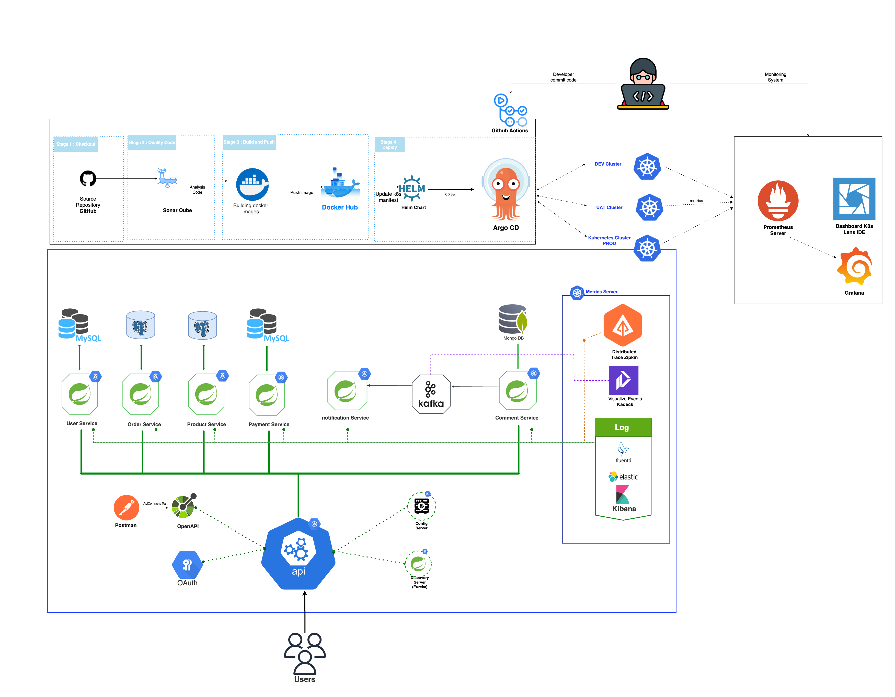

# E-commerce Microservices

---

## Table of Contents

1. [Project Overview](#project-overview)
2. [Architecture Overview](#architecture-overview)
3. [Microservices](#microservices)
4. [Getting Started](#getting-started)
    - [Prerequisites](#prerequisites)
    - [Local Setup](#local-setup)
    - [Keycloak Configuration](#keycloak-configuration)
    - [Testing the API](#testing-the-api)
5. [Deployment](#deployment)
    - [Local Deployment with Docker](#local-deployment-with-docker)
    - [Production Deployment with Kubernetes](#production-deployment-with-kubernetes)
6. [Security](#security)
7. [Monitoring and Tracing](#monitoring-and-tracing)
8. [CI/CD Pipeline](#cicd-pipeline)
9. [Troubleshooting](#troubleshooting)
    - [Keycloak Issues](#keycloak-issues)
    - [Docker Networking Issues](#docker-networking-issues)
    - [Service Discovery Issues](#service-discovery-issues)
10. [Contributing](#contributing)
11. [Future Enhancements](#future-enhancements)
12. [Resources](#resources)
13. [License](#license)

---

## Project Overview

This project demonstrates a microservices-based e-commerce platform built with modern technologies. It showcases best
practices for microservices architecture, including service discovery, centralized configuration, event-driven
communication, and containerized deployment. Key features include:

- **User Management**: Register, log in, and manage profiles with OAuth2 authentication via Keycloak.
- **Product Catalog**: Browse, create, and manage products with inventory tracking.
- **Order Processing**: Create, validate, and manage orders with a state machine.
- **Payment Integration**: Process payments via external gateways (e.g., Stripe).
- **Shopping Cart**: Manage user carts with Redis for fast access.
- **Shipment Tracking**: Handle order fulfillment and shipping.
- **Notifications**: Send email, SMS, or push notifications for order events.

The project is designed for scalability, resiliency, and maintainability, with monitoring and tracing for observability
in both local and production environments.

---

## Architecture Overview

The platform follows a microservices architecture, with each service independently deployable and communicating via REST
APIs or Kafka events. The architecture diagram below illustrates the components and their interactions:



### Core Technologies

- **Spring Boot 3.0**: Java 21-based framework for microservices.
- **Gradle**: Build automation for multi-module projects.
- **Spring Cloud Config**: Centralized configuration management (
  see [config-server/README.md](config-server/README.md)).
- **Eureka Server**: Service discovery for dynamic routing (
  see [service-registry/README.md](service-registry/README.md)).
- **Spring Cloud Gateway**: API Gateway for request routing, authentication, and rate limiting (
  see [api-gateway/README.md](api-gateway/README.md)).
- **Apache Kafka**: Event-driven communication using CloudEvents.
- **Keycloak**: OAuth2-based authentication and authorization.
- **Docker & Kubernetes**: Containerization and orchestration.
- **Databases**: MySQL, PostgreSQL, Redis for persistent and temporary storage.
- **Monitoring**: Zipkin, Prometheus, Grafana (local); Azure Application Insights, Azure Monitor (dev/prod).

For details on the multi-module setup, see [docs/multi-module.md](config/docs/multi-module.md).

---

## Microservices

The platform consists of configuration and core business services, each with specific responsibilities and storage:

| Service Type               | Service Name         | Description                                                               | Storage               | Documentation                                                    |
|----------------------------|----------------------|---------------------------------------------------------------------------|-----------------------|------------------------------------------------------------------|
| **Configuration Services** | Config Server        | Centralized configuration management for all services.                    | -                     | [config-server/README.md](config-server/README.md)               |
|                            | Eureka Server        | Service registry for dynamic discovery of microservices.                  | -                     | [service-registry/README.md](service-registry/README.md)         |
|                            | API Gateway          | Routes requests, handles authentication/authorization with Keycloak.      | Redis (rate limiting) | [api-gateway/README.md](api-gateway/README.md)                   |
| **Core Business Services** | User Service         | Manages user registration, login, and role-based authorization.           | PostgreSQL + Keycloak | [user-service/README.md](user-service/README.md)                 |
|                            | Product Service      | CRUD operations for products and inventory management.                    | MySQL                 | [product-service/README.md](product-service/README.md)           |
|                            | Order Service        | Processes orders with state machine, validation, and payment integration. | MySQL                 | [order-service/README.md](order-service/README.md)               |
|                            | Payment Service      | Handles payment processing with external gateways (e.g., Stripe).         | PostgreSQL            | [payment-service/README.md](payment-service/README.md)           |
|                            | Cart Service         | Manages user shopping carts for temporary item storage.                   | Redis                 | [cart-service/README.md](cart-service/README.md)                 |
|                            | Shipment Service     | Manages order fulfillment and shipping processes.                         | PostgreSQL            | [shipment-service/README.md](shipment-service/README.md)         |
|                            | Notification Service | Sends email, SMS, or push notifications based on order events.            | PostgreSQL (optional) | [notification-service/README.md](notification-service/README.md) |

For details on the order lifecycle, see [docs/order-state-machine.md](config/docs/order-state-machine.md).

---

## Getting Started

### Prerequisites

- **Java 21**
- **Gradle 8.0+**
- **Docker** and **Docker Compose**
- **Docker Desktop** with Kubernetes enabled
- **Postman** (optional for API testing)

### Local Setup

1. **Clone the Repository**:
   ```bash
   git clone https://github.com/puitiza/ecommerce.git
   cd ecommerce
   ```

2. **Start Services with Docker Compose**:
   ```bash
   docker-compose up --build -d
   ```

3. **Verify Services**:
    - API Gateway: `http://localhost:8090`
    - Swagger UI: `http://localhost:8090/swagger-ui.html`
    - Eureka Dashboard: `http://localhost:8761`
    - Keycloak Admin Console: `http://localhost:9090/admin` (Username: `admin`, Password: `admin`)

### Keycloak Configuration

Keycloak provides OAuth2 authentication for secure access. For local development, configure the `master` realm to allow
HTTP:

1. **Start Keycloak**:
   Ensure Keycloak and PostgreSQL are running via `docker-compose up -d`.

2. **Configure `master` Realm**:
   ```bash
   docker exec -it keycloak-server /bin/bash
   /opt/keycloak/bin/kcadm.sh config credentials --server http://localhost:8080 --realm master --user admin --password admin
   /opt/keycloak/bin/kcadm.sh update realms/master -s sslRequired=NONE
   exit
   ```

3. **Test the `ecommerce` Realm**:
   ```bash
   http://localhost:9090/realms/ecommerce/protocol/openid-connect/auth?client_id=api-gateway-client&response_type=code&redirect_uri=http://localhost:8090
   ```

> **Note**: HTTP is for development only. In production, enable HTTPS and set `sslRequired` to `external` or `all`.
> See [docs/production-setup.md](config/docs/production-setup.md).

### Testing the API

- **Swagger UI**: Access at `http://localhost:8090/swagger-ui.html` to test endpoints.
- **Postman**: Import `postman/ecommerce-collection.json` for pre-configured API tests.

---

## Deployment

### Local Deployment with Docker

Run the entire stack locally using Docker Compose:

```bash
  docker-compose up --build -d
```

To stop and clean up:

```bash
  docker-compose down -v
```

For advanced developer workflows (e.g., rebuilding a single service),
see [docs/developer-workflow.md](config/docs/developer-workflow.md).

### Production Deployment with Kubernetes

Deploy to Kubernetes (local Docker Desktop or Azure AKS) with the provided manifests.
See [docs/production-setup.md](config/docs/production-setup.md) for detailed instructions.

---

## Security

- **Authentication**: Keycloak with OAuth2 and JWT for all client-facing endpoints (except `POST /users/signup`,
  `POST /users/login`).
- **Authorization**: Role-based access for `ADMIN` and `USER` roles (
  see [Roles and Permissions](#roles-and-permissions)).
- **Rate Limiting**: Configured in API Gateway with Redis to prevent abuse.
- **Secrets Management**: Planned integration with Azure Key Vault for sensitive data.
- **HTTPS**: Planned for production to secure communication.

### Roles and Permissions

- **ADMIN**:
    - **User Service**: View all user details, update/delete users.
    - **Product Service**: Create, update, and delete products.
    - **Order Service**: View all orders, cancel any order.
    - **Shipment Service**: View all shipments, update shipment status.
- **USER**:
    - **User Service**: View/update own profile.
    - **Product Service**: Browse products.
    - **Cart Service**: Manage own cart.
    - **Order Service**: Create/view/cancel own orders.
    - **Shipment Service**: View own shipment status.
- **Internal (Service-to-Service)**:
    - **Payment Service**: Invoked by `order-service` via Kafka events.
    - **Shipment Service**: Invoked by `order-service` for shipment creation.
    - **Notification Service**: Triggered by Kafka events, no direct client access.
- **Authentication**:
    - All client-facing endpoints (except `POST /users/signup`, `POST /users/login`) require a JWT token from Keycloak.
    - Service-to-service communication uses API keys or Kubernetes network policies.

---

## Business Logic

See individual service READMES for detailed business logic:

- [order-service/README.md](order-service/README.md)
- [payment-service/README.md](payment-service/README.md)
- [product-service/README.md](product-service/README.md)

For the order lifecycle, see [docs/order-state-machine.md](config/docs/order-state-machine.md).

## Testing

- **Unit Tests**: JUnit 5 and Mockito for service logic.
- **Integration Tests**: Testcontainers for databases and Kafka.
- **Load Tests**: JMeter for API endpoint performance.
- **Configuration**: Run tests with `./gradlew test`.

---

## Monitoring and Tracing

- **Local**:
    - **Zipkin**: Distributed tracing (`http://localhost:9411`).
    - **Prometheus**: Metrics collection (`http://localhost:9090`).
    - **Grafana**: Metrics visualization (`http://localhost:3000`).
    - **AKHQ**: Kafka topic monitoring (`http://localhost:8081`).
- **Dev/Prod**:
    - **Azure Application Insights**: Tracing and diagnostics.
    - **Azure Monitor**: Metrics and log aggregation.

---

## CI/CD Pipeline

- **Tool**: GitHub Actions for automated build, test, and deployment.
- **Steps**:
    1. Run unit and integration tests with Gradle and Testcontainers.
    2. Perform code quality checks with SonarQube.
    3. Build and push Docker images to Docker Hub.
    4. Deploy to Kubernetes (local or Azure AKS).
- **Configuration**: See `.github/workflows/build.yml`.

---

## Troubleshooting

### Keycloak Issues

- **HTTPS Required Error**: Ensure `sslRequired` is set to `NONE` in the `master` realm (
  see [Keycloak Configuration](#keycloak-configuration)).
- **Client ID Null Error**: Verify `security-admin-console` client redirect URIs in Keycloak (
  `http://localhost:9090/admin/master/console/*`).
- **External IP Issues**: Access `http://localhost:9090` directly and clear browser cache.

### Docker Networking Issues

If you encounter a `Connection Refused` error or the Keycloak Admin Console fails to load:

1. Add `host.docker.internal` to your hosts file:
   ```text
   127.0.0.1 host.docker.internal
   ```
2. Update `docker-compose.yml` for Keycloak:
   ```yaml
   keycloak-server:
     environment:
       KC_HOSTNAME: host.docker.internal
       KC_HOSTNAME_PORT: 9090
       KC_HOSTNAME_STRICT: false
       KC_HOSTNAME_BACKCHANNEL_DYNAMIC: true
   ```
3. Update `KEYCLOAK_SERVER_URL`:
   ```yaml
   KEYCLOAK_SERVER_URL: http://host.docker.internal:9090
   ```

### Service Discovery Issues

- If services fail to register with Eureka, check logs:
  ```bash
  docker-compose logs service-registry
  ```
- Ensure Eureka is running at `http://localhost:8761`.

For more details, see [Troubleshooting](#troubleshooting) in individual service READMEs.

---

## Contributing

Contributions are welcome! Follow these steps:

1. Fork the repository.
2. Create a feature branch (`git checkout -b feature/new-feature`).
3. Adhere to coding standards (Checkstyle, SonarQube).
4. Submit a pull request with a clear description.

See [CONTRIBUTING.md](CONTRIBUTING.md) for detailed guidelines.

---

## Future Enhancements

- **Review Service**: Add product reviews and ratings (MongoDB).
- **Recommendation Service**: Suggest products using Neo4j or machine learning.
- **Analytics Service**: Analyze user/product data with Kafka Streams or Spark.
- **Internationalization**: Support multiple languages and currencies.
- **Fraud Detection**: Integrate Stripe Radar or custom rules.
- **Shared Library Enhancements**: Expand `share-library` for DTOs and utilities.

---

## Resources

- **Spring Cloud Config**: [Docker’s Health Check and Spring Boot Apps](https://medium.com/@aleksanderkolata/docker-spring-boot-and-containers-startup-order-39230e5352a4)
- **Keycloak**:
    - [Users and Client Secrets in Keycloak Realm Exports](https://candrews.integralblue.com/2021/09/users-and-client-secrets-in-keycloak-realm-exports/)
    - [Keycloak in Docker #5: Export a Realm with Users and Secrets](https://keepgrowing.in/tools/keycloak-in-docker-5-how-to-export-a-realm-with-users-and-secrets/)
- **Kubernetes Metrics Server**: [Enable Kubernetes Metrics Server on Docker Desktop](https://dev.to/docker/enable-kubernetes-metrics-server-on-docker-desktop-5434)
- **Example Projects**:
    - [Blog Application](https://github.com/cokutan/blogapplication/tree/develop)
    - [Spring Boot Microservices with Helm](https://github.com/numerica-ideas/community/tree/master/kubernetes/spring-microservice-deployment-gitlab-helm)

---

## License

This project is licensed under the MIT License. See [LICENSE](LICENSE) for details.

---

### Recommendations for Further Enhancements

- **Create a CONTRIBUTING.md File**: Detail coding standards, pull request templates, and contribution guidelines.
- **Add a CHANGELOG.md**: Track releases and changes for transparency.
- **Include Code Snippets**: Add examples of API calls or key configurations in relevant sections.
- **Visual Aids**: Consider adding more diagrams (e.g., sequence diagrams for order lifecycle) in `config/images/`.
- **Badges for Coverage**: Add a code coverage badge (e.g., Codecov) if integrated with CI/CD.
- **Collapsible Sections**: Use `<details><summary>` tags for optional content like advanced workflows if hosted on
  GitHub.