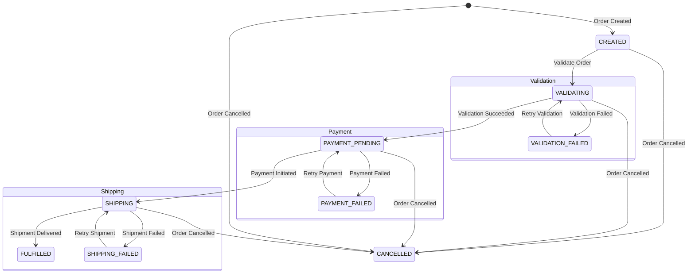

# Order State Machine

The `order-service` uses a state machine to manage the lifecycle of orders, including validation, payment, shipping, error handling, retries, and timeouts. Below is a detailed description of the states, transitions, and mechanisms.

## States
- `CREATED`: Initial state when an order is created.
- `VALIDATING`: Verifying order details and product availability.
- `VALIDATION_FAILED`: Verification failed (e.g., insufficient inventory).
- `PAYMENT_PENDING`: Payment processing is initiated.
- `PAYMENT_FAILED`: Payment processing failed (e.g., card declined).
- `SHIPPING`: Order is being processed for shipment by `shipment-service`.
- `SHIPPING_FAILED`: Shipment process failed (e.g., logistics issues).
- `FULFILLED`: Order is shipped and delivered.
- `CANCELLED`: Order is canceled by the user or admin.

## State Diagram

## Transitions

| Source State         | Event                  | Target State         | Description                                          | Retry | Timeout            |
|----------------------|------------------------|----------------------|------------------------------------------------------|-------|--------------------|
| `CREATED`            | `order_created`        | `VALIDATING`         | Order details and product availability are verified. | N/A   | 30s (validation)   |
| `VALIDATING`         | `validation_succeeded` | `PAYMENT_PENDING`    | Verification completed successfully.                 | N/A   | N/A                |
| `VALIDATING`         | `validation_failed`    | `VALIDATION_FAILED`  | Verification errors (e.g., insufficient inventory).  | Yes   | N/A                |
| `VALIDATION_FAILED`  | `retry_validation`     | `VALIDATING`         | Retrying validation after error resolution.          | N/A   | 30s (validation)   |
| `PAYMENT_PENDING`    | `payment_initiated`    | `SHIPPING`           | Payment processed successfully, shipment begins.     | Yes   | 60s (payment)      |
| `PAYMENT_PENDING`    | `payment_failed`       | `PAYMENT_FAILED`     | Payment processing failed (e.g., card declined).     | N/A   | N/A                |
| `PAYMENT_FAILED`     | `retry_payment`        | `PAYMENT_PENDING`    | Retrying payment after error resolution.             | N/A   | 60s (payment)      |
| `SHIPPING`           | `shipment_delivered`   | `FULFILLED`          | Order successfully shipped and delivered.            | N/A   | N/A                |
| `SHIPPING`           | `shipment_failed`      | `SHIPPING_FAILED`    | Shipment process failed (e.g., logistics issues).    | Yes   | 120s (shipment)    |
| `SHIPPING_FAILED`    | `retry_shipment`       | `SHIPPING`           | Retrying shipment after error resolution.            | N/A   | 120s (shipment)    |
| Any                  | `order_cancelled`      | `CANCELLED`          | Order canceled by user or admin.                     | N/A   | N/A                |

## Retry Mechanisms
- Retries are implemented for validation, payment, and shipment processes.
- Configurable parameters: 3 retries, 5-second delay between attempts.
- Events like `retry_validation`, `retry_payment`, and `retry_shipment` are triggered after timeouts or error resolution.

## Timeouts
- **Validation Timeout**: 30 seconds to ensure validation completes.
- **Payment Timeout**: 60 seconds to ensure payment processing completes.
- **Shipment Timeout**: 120 seconds to ensure shipment processing completes.
- If a timeout occurs, the state machine transitions to the corresponding error state (`VALIDATION_FAILED`, `PAYMENT_FAILED`, `SHIPPING_FAILED`).

## Error Handling
- Error states (`VALIDATION_FAILED`, `PAYMENT_FAILED`, `SHIPPING_FAILED`) capture failures.
- Actions include logging errors, sending notifications via `notification-service`, and triggering retries or cancellations.
- The `order-service` and `shipment-service` publish error events to Kafka for monitoring.

## Integration with Shipment Service
- The `SHIPPING` and `SHIPPING_FAILED` states are managed by the `shipment-service`, which integrates with external logistics APIs (e.g., FedEx, DHL).
- The `shipment-service` consumes `payment_initiated` events and publishes `shipment_delivered` or `shipment_failed` events to Kafka.