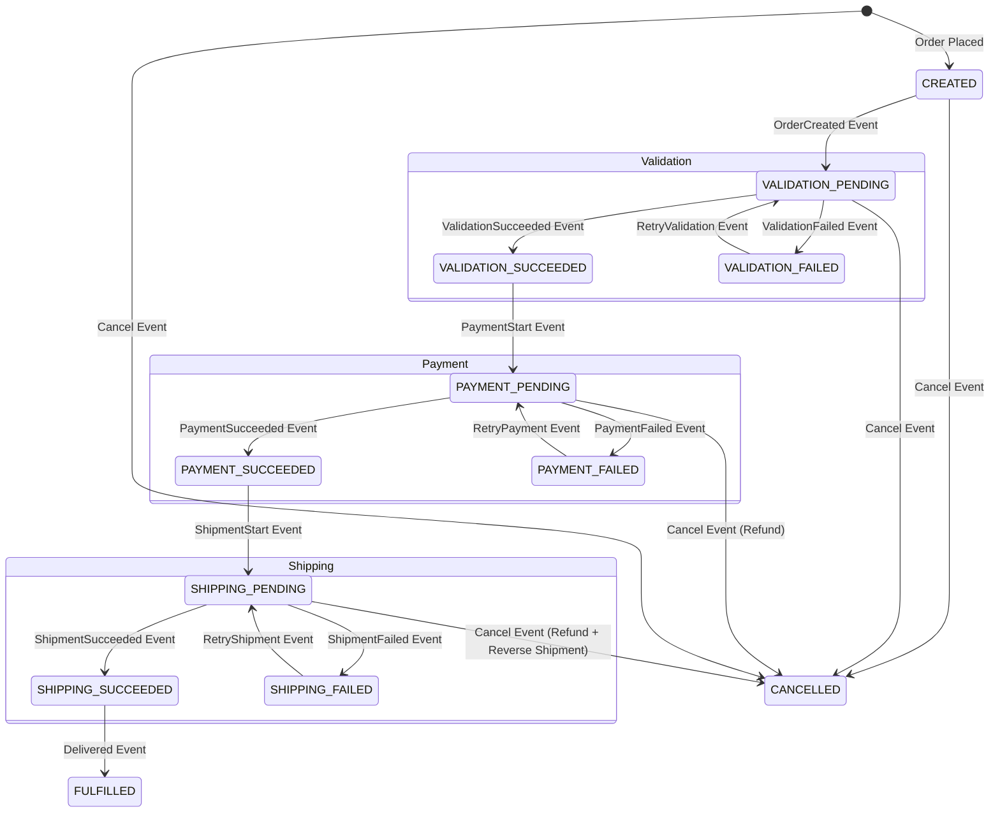

# Order State Machine

The `order-service` uses Spring State Machine to orchestrate the order lifecycle as a saga, handling validation,
payment, shipping, errors, retries, timeouts, and compensations (e.g., refunds, restock). This is event-driven:
order-service publishes events to Kafka; product/payment/shipment services listen, process, and publish results;
order-service listeners update the state machine.

## States

- `CREATED`: Initial state after order placement (basics validated).
- `VALIDATION_PENDING`: Awaiting stock validation/reservation by product-service.
- `VALIDATION_SUCCEEDED`: Stock validated and reserved.
- `VALIDATION_FAILED`: Stock validation failed (e.g., insufficient inventory).
- `PAYMENT_PENDING`: Awaiting payment authorization by payment-service.
- `PAYMENT_SUCCEEDED`: Payment authorized.
- `PAYMENT_FAILED`: Payment failed (e.g., card declined).
- `SHIPPING_PENDING`: Awaiting shipment processing by shipment-service.
- `SHIPPING_SUCCEEDED`: Shipped.
- `SHIPPING_FAILED`: Shipment failed (e.g., logistics issues).
- `FULFILLED`: Order delivered and completed.
- `CANCELLED`: Order canceled (with compensations like refund/restock).

## State Diagram

## Transitions

| Source State           | Event                 | Target State           | Description                                                  | Retry              | Timeout | Compensation on Failure/Cancel                   |
|------------------------|-----------------------|------------------------|--------------------------------------------------------------|--------------------|---------|--------------------------------------------------|
| `CREATED`              | `OrderCreated`        | `VALIDATION_PENDING`   | Publish to product-service for stock validation/reservation. | N/A                | 30s     | N/A                                              |
| `VALIDATION_PENDING`   | `ValidationSucceeded` | `VALIDATION_SUCCEEDED` | Stock reserved ok (from product-service).                    | N/A                | N/A     | N/A                                              |
| `VALIDATION_PENDING`   | `ValidationFailed`    | `VALIDATION_FAILED`    | Stock insufficient (from product-service).                   | Yes (3x, 5s delay) | N/A     | Cancel order, notify user.                       |
| `VALIDATION_FAILED`    | `RetryValidation`     | `VALIDATION_PENDING`   | Retry (auto or manual resolution).                           | N/A                | 30s     | N/A                                              |
| `VALIDATION_SUCCEEDED` | `PaymentStart`        | `PAYMENT_PENDING`      | Publish to payment-service for authorization.                | N/A                | 60s     | N/A                                              |
| `PAYMENT_PENDING`      | `PaymentSucceeded`    | `PAYMENT_SUCCEEDED`    | Payment ok (from payment-service).                           | N/A                | N/A     | N/A                                              |
| `PAYMENT_PENDING`      | `PaymentFailed`       | `PAYMENT_FAILED`       | Payment declined (from payment-service).                     | Yes (3x, 5s delay) | N/A     | Refund if partial, cancel.                       |
| `PAYMENT_FAILED`       | `RetryPayment`        | `PAYMENT_PENDING`      | Retry (e.g., user updates card).                             | N/A                | 60s     | N/A                                              |
| `PAYMENT_SUCCEEDED`    | `ShipmentStart`       | `SHIPPING_PENDING`     | Publish to shipment-service for processing.                  | N/A                | 120s    | N/A                                              |
| `SHIPPING_PENDING`     | `ShipmentSucceeded`   | `SHIPPING_SUCCEEDED`   | Shipped ok (from shipment-service).                          | N/A                | N/A     | N/A                                              |
| `SHIPPING_PENDING`     | `ShipmentFailed`      | `SHIPPING_FAILED`      | Logistics failed (from shipment-service).                    | Yes (3x, 5s delay) | N/A     | Refund, restock via events.                      |
| `SHIPPING_FAILED`      | `RetryShipment`       | `SHIPPING_PENDING`     | Retry (e.g., re-route).                                      | N/A                | 120s    | N/A                                              |
| `SHIPPING_SUCCEEDED`   | `Delivered`           | `FULFILLED`            | Delivery confirmed (from shipment-service).                  | N/A                | N/A     | N/A                                              |
| Any                    | `Cancel`              | `CANCELLED`            | User/admin cancel; trigger compensations.                    | N/A                | N/A     | Refund, restock, reverse shipment if applicable. |

## Retry Mechanisms

- Retries for PENDING -> FAILED transitions (validation, payment, shipment).
- Configurable: 3 attempts, 5-second exponential backoff.
- Triggered by State Machine actions/guards or manual events (e.g., user fixes payment).

## Timeouts

- **Validation Timeout**: 30s (if no response from product-service, transition to VALIDATION_FAILED).
- **Payment Timeout**: 60s (to PAYMENT_FAILED).
- **Shipment Timeout**: 120s (to SHIPPING_FAILED).
- Handled by State Machine timers; on timeout, publish failure event and compensate.

## Error Handling

- FAILED states log errors, notify via notification-service, and trigger retries or cancellations.
- All services publish error events to Kafka for monitoring (e.g., Dead Letter Queue for failed events).
- Compensations: On cancel/failure, publish events like RefundRequest (payment listens), RestockRequest (product
  listens).

## Integration with Other Services

- **Product-Service**: Listens to OrderCreated/ValidationRetry, validates/reserves stock, publishes
  ValidationSucceeded/Failed or Restock on cancel.
- **Payment-Service**: Listens to PaymentStart/PaymentRetry, authorizes, publishes PaymentSucceeded/Failed or Refund on
  cancel.
- **Shipment-Service**: Listens to ShipmentStart/ShipmentRetry, processes logistics (FedEx/DHL), publishes
  ShipmentSucceeded/Failed or Reverse on cancel.
- Order-service listeners update State Machine on incoming events.