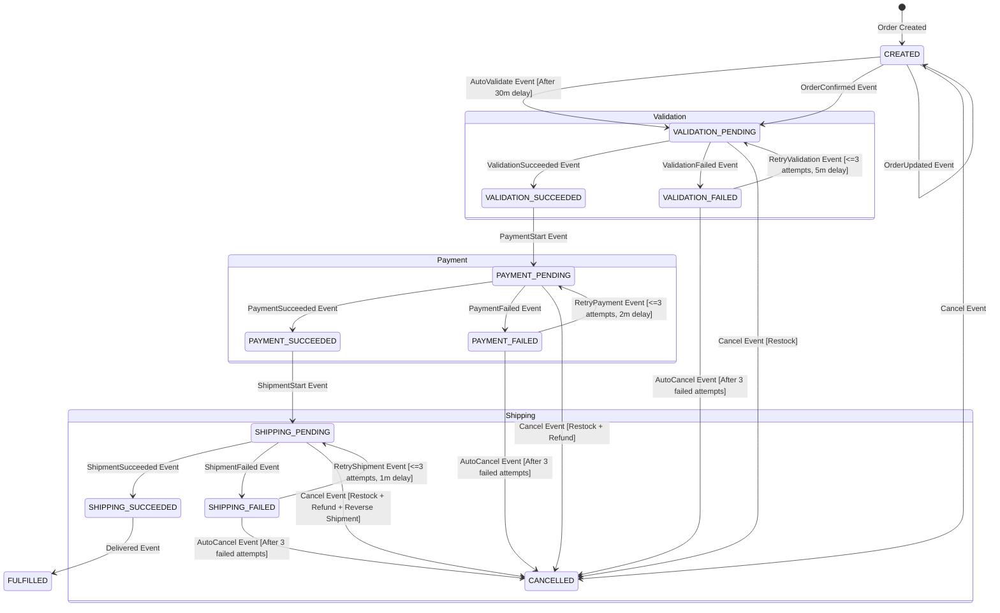
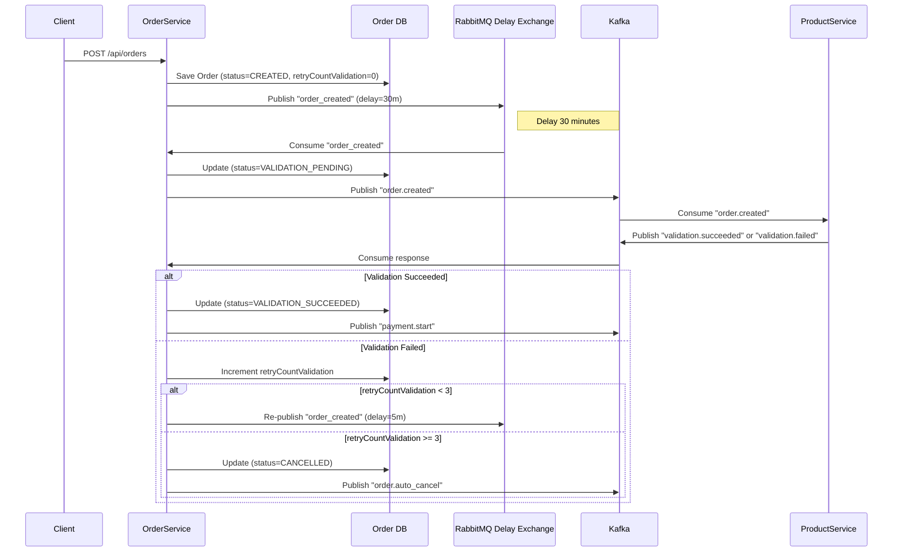
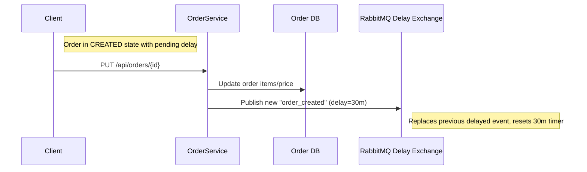
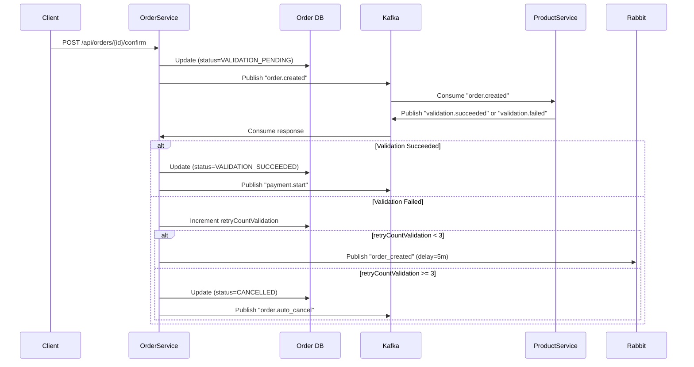
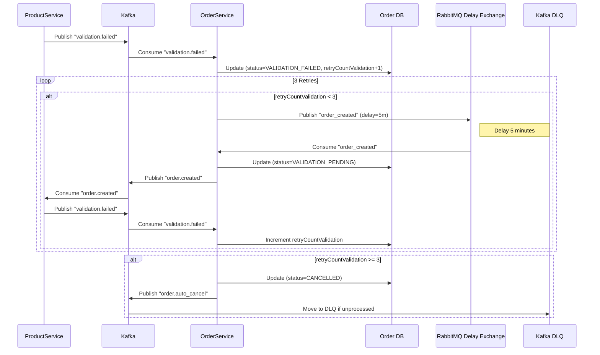
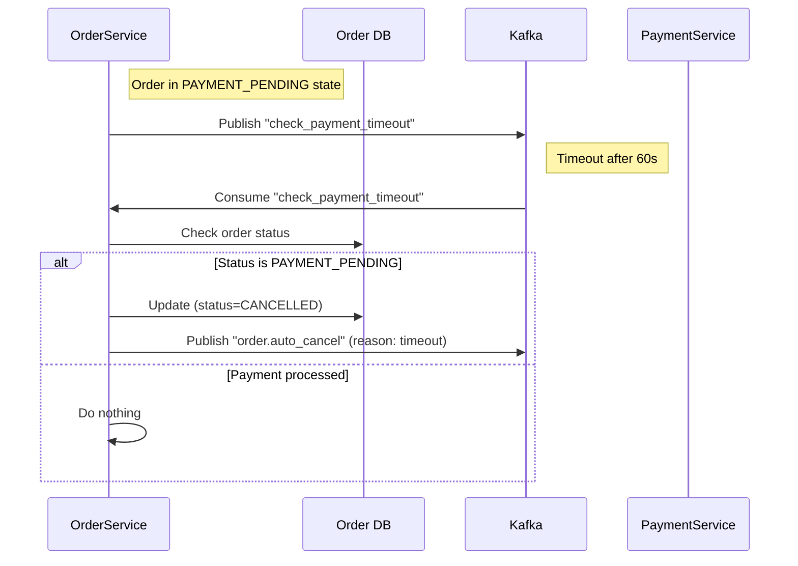
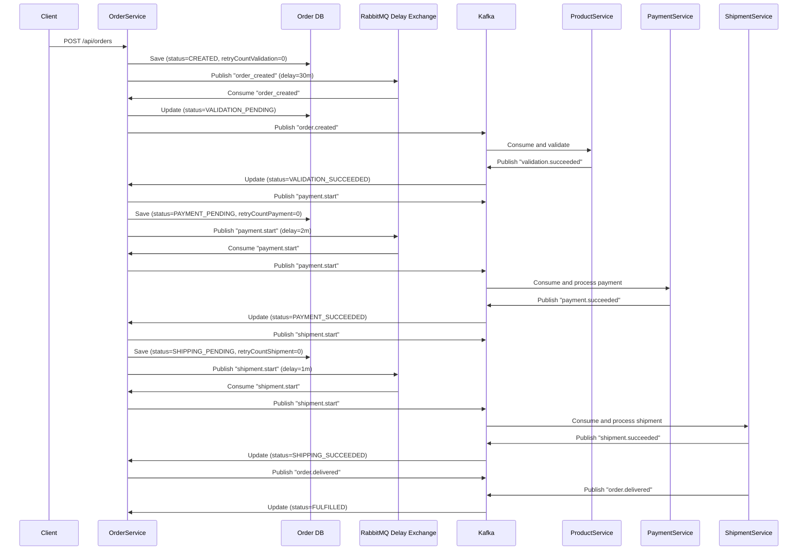

# Order State Machine

The `order-service` uses **Spring State Machine** to manage the order lifecycle as a saga, orchestrating validation,
payment, and shipping. It operates as an event-driven system, publishing events to a message broker (**Kafka** for main
events, **RabbitMQ** for delayed validation). Services like `product-service`, `payment-service`, and `shipment-service`
consume these events, process requests, and publish responses, which the `order-service` uses to update the state
machine.

## States

| State                  | Description                                                                                       |
|------------------------|---------------------------------------------------------------------------------------------------|
| `CREATED`              | Order is created and awaiting validation trigger (manual or delayed).                             |
| `VALIDATION_PENDING`   | Awaiting stock validation and reservation from `product-service`.                                 |
| `VALIDATION_SUCCEEDED` | Stock validated and reserved successfully.                                                        |
| `VALIDATION_FAILED`    | Stock validation failed (e.g., insufficient inventory).                                           |
| `PAYMENT_PENDING`      | Awaiting payment authorization from `payment-service`.                                            |
| `PAYMENT_SUCCEEDED`    | Payment authorized successfully.                                                                  |
| `PAYMENT_FAILED`       | Payment authorization failed (e.g., card declined).                                               |
| `SHIPPING_PENDING`     | Awaiting shipment processing from `shipment-service`.                                             |
| `SHIPPING_SUCCEEDED`   | Order shipped successfully.                                                                       |
| `SHIPPING_FAILED`      | Shipment processing failed (e.g., logistics issues).                                              |
| `FULFILLED`            | Order delivered, completing the lifecycle.                                                        |
| `CANCELLED`            | Order cancelled manually or due to unrecoverable errors (e.g., validation failure after retries). |

## State Diagram

## Transitions and Saga Logic

| Source State           | Event                  | Target State           | Action(s)                                           | Retries    | Timeout/Delay | Compensating Action (on Cancel) |
|------------------------|------------------------|------------------------|-----------------------------------------------------|------------|---------------|---------------------------------|
| `CREATED`              | `AUTO_VALIDATE`        | `VALIDATION_PENDING`   | Consume RabbitMQ delayed `OrderCreatedEvent`        | N/A        | 30m delay     | None                            |
| `CREATED`              | `ORDER_CONFIRMED`      | `VALIDATION_PENDING`   | Publish `OrderCreatedEvent` to `product-service`    | N/A        | N/A           | None                            |
| `CREATED`              | `ORDER_UPDATED`        | `CREATED`              | Reset RabbitMQ delay timer, update order            | N/A        | 30m reset     | None                            |
| `VALIDATION_PENDING`   | `VALIDATION_SUCCEEDED` | `VALIDATION_SUCCEEDED` | Publish `PaymentStartEvent` to `payment-service`    | N/A        | 30s timeout   | Restock                         |
| `VALIDATION_PENDING`   | `VALIDATION_FAILED`    | `VALIDATION_FAILED`    | Log failure, increment retry count                  | N/A        | N/A           | Restock                         |
| `VALIDATION_FAILED`    | `RETRY_VALIDATION`     | `VALIDATION_PENDING`   | Publish delayed `OrderCreatedEvent`                 | 3 attempts | 5m delay      | Restock                         |
| `VALIDATION_FAILED`    | `AUTO_CANCEL`          | `CANCELLED`            | Publish `AutoCancelEvent` (after 3 failed attempts) | N/A        | N/A           | Restock                         |
| `VALIDATION_SUCCEEDED` | `PAYMENT_START`        | `PAYMENT_PENDING`      | Publish `PaymentStartEvent` to `payment-service`    | N/A        | 2m delay      | Restock                         |
| `PAYMENT_PENDING`      | `PAYMENT_SUCCEEDED`    | `PAYMENT_SUCCEEDED`    | Publish `ShipmentStartEvent` to `shipment-service`  | N/A        | 60s timeout   | Restock + Refund                |
| `PAYMENT_PENDING`      | `PAYMENT_FAILED`       | `PAYMENT_FAILED`       | Log failure, increment retry count                  | N/A        | N/A           | Restock + Refund                |
| `PAYMENT_FAILED`       | `RETRY_PAYMENT`        | `PAYMENT_PENDING`      | Publish delayed `PaymentStartEvent`                 | 3 attempts | 2m delay      | Restock + Refund                |
| `PAYMENT_FAILED`       | `AUTO_CANCEL`          | `CANCELLED`            | Publish `AutoCancelEvent` (after 3 failed attempts) | N/A        | N/A           | Restock + Refund                |
| `PAYMENT_SUCCEEDED`    | `SHIPMENT_START`       | `SHIPPING_PENDING`     | Publish `ShipmentStartEvent` to `shipment-service`  | N/A        | 1m delay      | Restock + Refund                |
| `SHIPPING_PENDING`     | `SHIPPING_SUCCEEDED`   | `SHIPPING_SUCCEEDED`   | Publish `DeliveredEvent`                            | N/A        | 120s timeout  | Restock + Refund + Reverse      |
| `SHIPPING_PENDING`     | `SHIPPING_FAILED`      | `SHIPPING_FAILED`      | Log failure, increment retry count                  | N/A        | N/A           | Restock + Refund + Reverse      |
| `SHIPPING_FAILED`      | `RETRY_SHIPMENT`       | `SHIPPING_PENDING`     | Publish delayed `ShipmentStartEvent`                | 3 attempts | 1m delay      | Restock + Refund + Reverse      |
| `SHIPPING_FAILED`      | `AUTO_CANCEL`          | `CANCELLED`            | Publish `AutoCancelEvent` (after 3 failed attempts) | N/A        | N/A           | Restock + Refund + Reverse      |
| `SHIPPING_SUCCEEDED`   | `DELIVERED`            | `FULFILLED`            | Log fulfillment, end saga                           | N/A        | N/A           | None                            |
| Any `_PENDING`         | `CANCEL`               | `CANCELLED`            | Publish `CancelEvent`, trigger compensating actions | N/A        | N/A           | Per state                       |

## Retry and Timeout Mechanisms

- **Retries**:
    - Validation, payment, and shipment failures allow up to 3 retry attempts with delays:
        - Validation: 5-minute delay between retries (via RabbitMQ).
        - Payment: 2-minute delay between retries (via RabbitMQ).
        - Shipment: 1-minute delay between retries (via RabbitMQ).
    - After 3 failed attempts, the order transitions to `CANCELLED` via an `AutoCancelEvent`.
- **Timeouts**:
    - `VALIDATION_PENDING`: 30 seconds for service response.
    - `PAYMENT_PENDING`: 60 seconds for service response.
    - `SHIPPING_PENDING`: 120 seconds for service response.
    - If no response is received, the state transitions to the corresponding `_FAILED` state.
- **RabbitMQ Delay**:
    - Orders in `CREATED` state are sent to a RabbitMQ delay exchange with a **30-minute delay** before transitioning to
      `VALIDATION_PENDING`.
    - Updates to the order reset this 30-minute timer.
    - Validation retries use a 5-minute delay to avoid overwhelming the system.

## Error Handling

- **Logging**: Failures in validation, payment, or shipment are logged with detailed error messages.
- **Compensation**: The `CANCELLED` state triggers compensating actions:
    - `VALIDATION_PENDING`: Restock inventory in `product-service`.
    - `PAYMENT_PENDING`: Restock + refund in `payment-service`.
    - `SHIPPING_PENDING`: Restock + refund + reverse shipment in `shipment-service`.
- **Dead Letter Queue (DLQ)**: Kafka’s DLQ captures unprocessed events after retries, triggering cancellation.

## Integration with Other Services

- **Message Brokers**:
    - **RabbitMQ**: Handles delayed events (30m for initial validation, 5m for validation retries, 2m for payment
      retries, 1m for shipment retries).
    - **Kafka**: Manages main event flow and retries, with a DLQ for unprocessed events.
- **Services**:
    - `product-service`: Consumes `OrderCreatedEvent`, responds with `ValidationSucceeded` or `ValidationFailed`.
    - `payment-service`: Consumes `PaymentStartEvent`, responds with `PaymentSucceeded` or `PaymentFailed`.
    - `shipment-service`: Consumes `ShipmentStartEvent`, responds with `ShipmentSucceeded` or `ShipmentFailed`.

## Key Features

1. **Delayed Validation**: Orders in `CREATED` state wait **30 minutes** (via RabbitMQ delay exchange) before
   transitioning to `VALIDATION_PENDING`, allowing users time to update the order, unless manually confirmed.
2. **Retry Logic**: Up to 3 retry attempts for validation (5m delay), payment (2m delay), and shipment (1m delay).
   Failure after 3 attempts triggers `CANCELLED`.
3. **Compensating Actions**: Cancelling an order triggers appropriate actions (restock, refund, shipment reversal) based
   on the state.
4. **Timeouts**: Prevent orders from stalling in `_PENDING` states.
5. **Order Confirmation Endpoint**: Allows immediate validation, bypassing the 30-minute delay.

## Sequence Diagrams

### 1. Order Creation with Delayed Validation

### 2. Order Update (Reset Delay)

### 3. Immediate Order Confirmation

### 4. Validation Failure with Retries and Cancellation

### 5. Automatic Cancellation for Non-Payment (Timeout)

### 6. Full Order Lifecycle (Happy Path)

