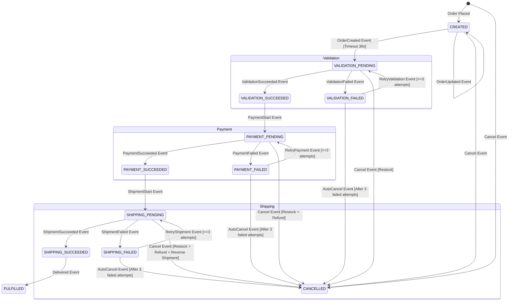

# Order State Machine

The `order-service` uses **Spring State Machine** to orchestrate the order lifecycle as a saga, handling validation,
payment, and shipping. This is an event-driven system: the `order-service` publishes events to a message broker (like
Kafka). Other services—such as product, payment, and shipment—listen, process the requests, and publish their results.
The `order-service` then listens for these responses and updates its state machine accordingly.

## States

| State                  | Description                                                                    |
|------------------------|--------------------------------------------------------------------------------|
| `CREATED`              | Initial state after an order is placed and basic validations are completed.    |
| `VALIDATION_PENDING`   | Awaiting stock validation and reservation from the product service.            |
| `VALIDATION_SUCCEEDED` | Stock has been successfully validated and reserved.                            |
| `VALIDATION_FAILED`    | Stock validation failed (e.g., insufficient inventory).                        |
| `PAYMENT_PENDING`      | Awaiting payment authorization from the payment service.                       |
| `PAYMENT_SUCCEEDED`    | Payment has been successfully authorized.                                      |
| `PAYMENT_FAILED`       | Payment authorization failed (e.g., card declined).                            |
| `SHIPPING_PENDING`     | Awaiting shipment processing from the shipment service.                        |
| `SHIPPING_SUCCEEDED`   | The order has been successfully shipped.                                       |
| `SHIPPING_FAILED`      | Shipment processing failed (e.g., logistics issues).                           |
| `FULFILLED`            | The order has been delivered and the lifecycle is complete.                    |
| `CANCELLED`            | The order has been canceled, either manually or due to an unrecoverable error. |

-----

## State Diagram

-----

## Transitions and Saga Logic

This table details the transitions, events, actions, and saga-related logic for each step in the order lifecycle.

| Source State           | Event                  | Target State           | Action(s)                                           | Retries    | Timeout | Compensating Action (on Cancel) |
|------------------------|------------------------|------------------------|-----------------------------------------------------|------------|---------|---------------------------------|
| `CREATED`              | `ORDER_CREATED`        | `VALIDATION_PENDING`   | Publish `OrderCreatedEvent` to `product-service`    | N/A        | 30s     | None                            |
| `CREATED`              | `ORDER_UPDATED`        | `CREATED`              | Publish `OrderUpdatedEvent` for notifications       | N/A        | N/A     | None                            |
| `VALIDATION_PENDING`   | `VALIDATION_SUCCEEDED` | `VALIDATION_SUCCEEDED` | Publish `PaymentStartEvent` to `payment-service`    | N/A        | 30s     | Restock                         |
| `VALIDATION_PENDING`   | `VALIDATION_FAILED`    | `VALIDATION_FAILED`    | Log failure, increment retry count                  | N/A        | N/A     | Restock                         |
| `VALIDATION_FAILED`    | `RETRY_VALIDATION`     | `VALIDATION_PENDING`   | Retry validation (if < 3 attempts)                  | 3 attempts | 30s     | Restock                         |
| `VALIDATION_FAILED`    | `AUTO_CANCEL`          | `CANCELLED`            | Publish `CancelEvent` (after 3 failed attempts)     | N/A        | N/A     | Restock                         |
| `VALIDATION_SUCCEEDED` | `PAYMENT_START`        | `PAYMENT_PENDING`      | Publish `PaymentStartEvent` to `payment-service`    | N/A        | 60s     | Restock                         |
| `PAYMENT_PENDING`      | `PAYMENT_SUCCEEDED`    | `PAYMENT_SUCCEEDED`    | Publish `ShipmentStartEvent` to `shipment-service`  | N/A        | N/A     | Restock + Refund                |
| `PAYMENT_PENDING`      | `PAYMENT_FAILED`       | `PAYMENT_FAILED`       | Log failure, increment retry count                  | N/A        | N/A     | Restock + Refund                |
| `PAYMENT_FAILED`       | `RETRY_PAYMENT`        | `PAYMENT_PENDING`      | Retry payment (if < 3 attempts)                     | 3 attempts | 60s     | Restock + Refund                |
| `PAYMENT_FAILED`       | `AUTO_CANCEL`          | `CANCELLED`            | Publish `CancelEvent` (after 3 failed attempts)     | N/A        | N/A     | Restock + Refund                |
| `PAYMENT_SUCCEEDED`    | `SHIPMENT_START`       | `SHIPPING_PENDING`     | Publish `ShipmentStartEvent` to `shipment-service`  | N/A        | 120s    | Restock + Refund                |
| `SHIPPING_PENDING`     | `SHIPMENT_SUCCEEDED`   | `SHIPPING_SUCCEEDED`   | Publish `DeliveredEvent`                            | N/A        | N/A     | Restock + Refund + Reverse      |
| `SHIPPING_PENDING`     | `SHIPMENT_FAILED`      | `SHIPPING_FAILED`      | Log failure, increment retry count                  | N/A        | N/A     | Restock + Refund + Reverse      |
| `SHIPPING_FAILED`      | `RETRY_SHIPMENT`       | `SHIPPING_PENDING`     | Retry shipment (if < 3 attempts)                    | 3 attempts | 120s    | Restock + Refund + Reverse      |
| `SHIPPING_FAILED`      | `AUTO_CANCEL`          | `CANCELLED`            | Publish `CancelEvent` (after 3 failed attempts)     | N/A        | N/A     | Restock + Refund + Reverse      |
| `SHIPPING_SUCCEEDED`   | `DELIVERED`            | `FULFILLED`            | Log fulfillment, end saga                           | N/A        | N/A     | None                            |
| Any `_PENDING`         | `CANCEL`               | `CANCELLED`            | Publish `CancelEvent`, trigger compensating actions | N/A        | N/A     | Per state                       |

-----

## Retry and Timeout Mechanisms

- **Retries:** All failed transitions (`VALIDATION_FAILED`, `PAYMENT_FAILED`, `SHIPPING_FAILED`) include a guard that
  allows up to three retry attempts. If the retry count is exceeded, the order is automatically moved to the `CANCELLED`
  state.
- **Timeouts:** The state machine incorporates timers for key transitions. If a service doesn't respond with a success
  or failure event within the specified time, the state machine automatically triggers a failure event and transitions
  to the corresponding `_FAILED` state.
    - **Validation Timeout:** 30 seconds
    - **Payment Timeout:** 60 seconds
    - **Shipment Timeout:** 120 seconds

## Error Handling

- **Logging:** All failure actions (`validationFailedAction`, `paymentFailedAction`, `shipmentFailedAction`) log
  detailed errors.
- **Compensation:** The `CANCELLED` state handles the "compensation" part of the saga pattern. When an order is
  canceled, an event is published that can trigger actions in other services, such as a **refund** (in the payment
  service) or a **restocking of inventory** (in the product service).

-----

## Integration with Other Services

The `order-service` acts as the orchestrator in this saga by communicating with other services through a message broker:

- **Product-Service:** Listens for `OrderCreatedEvent` and `RetryValidationEvent`. It responds with
  `ValidationSucceededEvent` or `ValidationFailedEvent`.
- **Payment-Service:** Listens for `PaymentStartEvent` and `RetryPaymentEvent`. It responds with `PaymentSucceededEvent`
  or `PaymentFailedEvent`.
- **Shipment-Service:** Listens for `ShipmentStartEvent` and `RetryShipmentEvent`. It responds with
  `ShipmentSucceededEvent` or `ShipmentFailedEvent`.

This event-driven architecture ensures loose coupling and high resilience, as each service can operate independently
while the `order-service` manages the overall flow.

-----

## Key Enhancements:

1. **Automatic Transition to VALIDATION_PENDING**: If an order remains in `CREATED` for 30 seconds without updates, it
   automatically transitions to `VALIDATION_PENDING` to start the validation process.
2. **Retry Limits**: After three failed attempts in `VALIDATION_FAILED`, `PAYMENT_FAILED`, or `SHIPPING_FAILED`, the
   order automatically transitions to `CANCELLED` via an `AutoCancel` event.
3. **Compensating Actions**:
    - `VALIDATION_PENDING` cancellation triggers a restock in `product-service`.
    - `PAYMENT_PENDING` cancellation triggers a restock and a refund in `payment-service`.
    - `SHIPPING_PENDING` cancellation triggers a restock, refund, and shipment reversal.
4. **Timeouts**: Each `_PENDING` state has a timeout to prevent orders from being stuck indefinitely.
5. **Endpoint for Confirmation**: An endpoint in `order-service` to explicitly start the validation process (optional,
   as the timeout handles automatic transitions).
