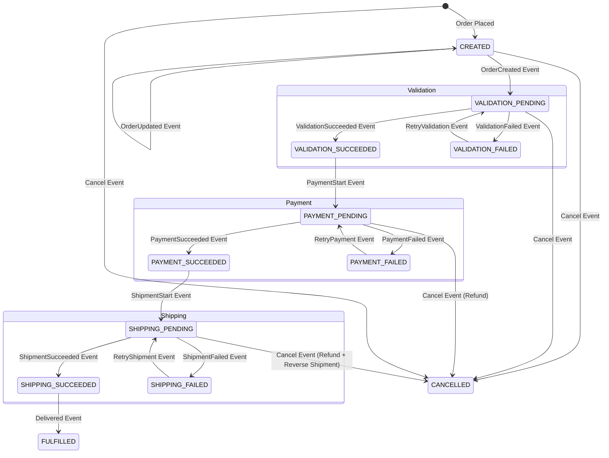

# Order State Machine

The `order-service` uses **Spring State Machine** to orchestrate the order lifecycle as a saga, handling validation,
payment, and shipping. This is an event-driven system: the `order-service` publishes events to a message broker (like
Kafka). Other services—such as product, payment, and shipment—listen, process the requests, and publish their results.
The `order-service` then listens for these responses and updates its state machine accordingly.

## States

| State                  | Description                                                                    |
|------------------------|--------------------------------------------------------------------------------|
| `CREATED`              | Initial state after an order is placed and basic validations are completed.    |
| `VALIDATION_PENDING`   | Awaiting stock validation and reservation from the product service.            |
| `VALIDATION_SUCCEEDED` | Stock has been successfully validated and reserved.                            |
| `VALIDATION_FAILED`    | Stock validation failed (e.g., insufficient inventory).                        |
| `PAYMENT_PENDING`      | Awaiting payment authorization from the payment service.                       |
| `PAYMENT_SUCCEEDED`    | Payment has been successfully authorized.                                      |
| `PAYMENT_FAILED`       | Payment authorization failed (e.g., card declined).                            |
| `SHIPPING_PENDING`     | Awaiting shipment processing from the shipment service.                        |
| `SHIPPING_SUCCEEDED`   | The order has been successfully shipped.                                       |
| `SHIPPING_FAILED`      | Shipment processing failed (e.g., logistics issues).                           |
| `FULFILLED`            | The order has been delivered and the lifecycle is complete.                    |
| `CANCELLED`            | The order has been canceled, either manually or due to an unrecoverable error. |

-----

## State Diagram

-----

## Transitions and Saga Logic

This table details the transitions, events, actions, and saga-related logic for each step in the order lifecycle.

| Source State           | Event                  | Target State           | Action(s)                                                                                                     | Retries          | Timeouts    |
|------------------------|------------------------|------------------------|---------------------------------------------------------------------------------------------------------------|------------------|-------------|
| `CREATED`              | `ORDER_CREATED`        | `VALIDATION_PENDING`   | Publishes `OrderCreatedEvent` to trigger stock validation in the product service.                             | N/A              | 30 seconds  |
| `CREATED`              | `ORDER_UPDATED`        | `CREATED`              | Publishes `OrderUpdatedEvent` for external notifications without changing the state.                          | N/A              | N/A         |
| `VALIDATION_PENDING`   | `VALIDATION_SUCCEEDED` | `VALIDATION_SUCCEEDED` | Publishes `PaymentStartEvent` to initiate the payment process.                                                | N/A              | N/A         |
| `VALIDATION_PENDING`   | `VALIDATION_FAILED`    | `VALIDATION_FAILED`    | Logs the failure and prepares for a possible retry or cancellation.                                           | N/A              | N/A         |
| `VALIDATION_FAILED`    | `RETRY_VALIDATION`     | `VALIDATION_PENDING`   | Retries the validation process. The guard checks the retry count.                                             | Up to 3 attempts | 30 seconds  |
| `VALIDATION_SUCCEEDED` | `PAYMENT_START`        | `PAYMENT_PENDING`      | Publishes `PaymentStartEvent` to request payment from the payment service.                                    | N/A              | 60 seconds  |
| `PAYMENT_PENDING`      | `PAYMENT_SUCCEEDED`    | `PAYMENT_SUCCEEDED`    | Publishes `ShipmentStartEvent` to begin the shipping process.                                                 | N/A              | N/A         |
| `PAYMENT_PENDING`      | `PAYMENT_FAILED`       | `PAYMENT_FAILED`       | Logs the payment failure and prepares for a possible retry or cancellation.                                   | N/A              | N/A         |
| `PAYMENT_FAILED`       | `RETRY_PAYMENT`        | `PAYMENT_PENDING`      | Retries the payment process. The guard checks the retry count.                                                | Up to 3 attempts | 60 seconds  |
| `PAYMENT_SUCCEEDED`    | `SHIPMENT_START`       | `SHIPPING_PENDING`     | Publishes `ShipmentStartEvent` to request shipment from the shipment service.                                 | N/A              | 120 seconds |
| `SHIPPING_PENDING`     | `SHIPMENT_SUCCEEDED`   | `SHIPPING_SUCCEEDED`   | Publishes `DeliveredEvent` to signal the completion of the shipping phase.                                    | N/A              | N/A         |
| `SHIPPING_PENDING`     | `SHIPMENT_FAILED`      | `SHIPPING_FAILED`      | Logs the shipment failure and prepares for a possible retry or cancellation.                                  | N/A              | N/A         |
| `SHIPPING_FAILED`      | `RETRY_SHIPMENT`       | `SHIPPING_PENDING`     | Retries the shipment process. The guard checks the retry count.                                               | Up to 3 attempts | 120 seconds |
| `SHIPPING_SUCCEEDED`   | `DELIVERED`            | `FULFILLED`            | Logs the final fulfillment of the order, ending the saga.                                                     | N/A              | N/A         |
| Any `_PENDING` state   | `CANCEL`               | `CANCELLED`            | Publishes a `CancelEvent`, which triggers a refund and/or restock of items via the saga's compensation logic. | N/A              | N/A         |

-----

## Retry and Timeout Mechanisms

- **Retries:** All failed transitions (`VALIDATION_FAILED`, `PAYMENT_FAILED`, `SHIPPING_FAILED`) include a guard that
  allows up to three retry attempts. If the retry count is exceeded, the order is automatically moved to the `CANCELLED`
  state.
- **Timeouts:** The state machine incorporates timers for key transitions. If a service doesn't respond with a success
  or failure event within the specified time, the state machine automatically triggers a failure event and transitions
  to the corresponding `_FAILED` state.
    - **Validation Timeout:** 30 seconds
    - **Payment Timeout:** 60 seconds
    - **Shipment Timeout:** 120 seconds

## Error Handling

- **Logging:** All failure actions (`validationFailedAction`, `paymentFailedAction`, `shipmentFailedAction`) log
  detailed errors.
- **Compensation:** The `CANCELLED` state handles the "compensation" part of the saga pattern. When an order is
  canceled, an event is published that can trigger actions in other services, such as a **refund** (in the payment
  service) or a **restocking of inventory** (in the product service).

-----

## Integration with Other Services

The `order-service` acts as the orchestrator in this saga by communicating with other services through a message broker:

- **Product-Service:** Listens for `OrderCreatedEvent` and `RetryValidationEvent`. It responds with
  `ValidationSucceededEvent` or `ValidationFailedEvent`.
- **Payment-Service:** Listens for `PaymentStartEvent` and `RetryPaymentEvent`. It responds with `PaymentSucceededEvent`
  or `PaymentFailedEvent`.
- **Shipment-Service:** Listens for `ShipmentStartEvent` and `RetryShipmentEvent`. It responds with
  `ShipmentSucceededEvent` or `ShipmentFailedEvent`.

This event-driven architecture ensures loose coupling and high resilience, as each service can operate independently
while the `order-service` manages the overall flow.