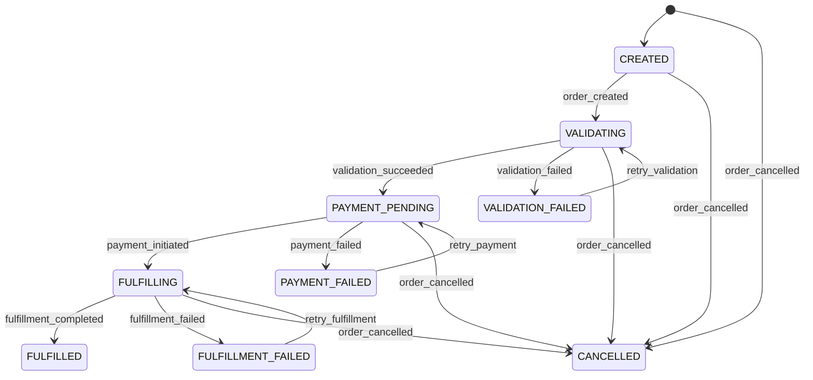

# Order State Machine

The `order-service` uses a state machine to manage the lifecycle of orders, including error handling, retries, and timeouts. Below is a detailed description of the states, transitions, and mechanisms.

## States
- `CREATED`: Initial state after an order is created.
- `VALIDATING`: Order details and product availability are being verified.
- `VALIDATION_FAILED`: Verification failed due to errors.
- `PAYMENT_PENDING`: Payment processing is initiated.
- `PAYMENT_FAILED`: Payment processing failed.
- `FULFILLING`: Order fulfillment process is ongoing.
- `FULFILLMENT_FAILED`: Fulfillment process failed due to errors.
- `FULFILLED`: Order is shipped and completed.
- `CANCELLED`: Order is canceled at any point.

## State Diagram

## Transitions

| Source State         | Event                   | Target State         | Description                                          | Retry | Timeout             |
|----------------------|-------------------------|----------------------|------------------------------------------------------|-------|---------------------|
| `CREATED`            | `order_created`         | `VALIDATING`         | Order details and product availability are verified. | N/A   | Validation timeout  |
| `VALIDATING`         | `validation_succeeded`  | `PAYMENT_PENDING`    | Successful verification.                             | N/A   | N/A                 |
| `VALIDATING`         | `validation_failed`     | `VALIDATION_FAILED`  | Verification errors occurred.                        | Yes   | N/A                 |
| `VALIDATION_FAILED`  | `retry_validation`      | `VALIDATING`         | Retrying validation after error resolution.          | N/A   | Validation timeout  |
| `PAYMENT_PENDING`    | `payment_initiated`     | `FULFILLING`         | Payment processing initiated.                        | Yes   | Payment timeout     |
| `PAYMENT_PENDING`    | `payment_failed`        | `PAYMENT_FAILED`     | Payment processing failed.                           | N/A   | N/A                 |
| `PAYMENT_FAILED`     | `retry_payment`         | `PAYMENT_PENDING`    | Retrying payment after error resolution.             | N/A   | Payment timeout     |
| `FULFILLING`         | `fulfillment_completed` | `FULFILLED`          | Order successfully shipped.                          | N/A   | N/A                 |
| `FULFILLING`         | `fulfillment_failed`    | `FULFILLMENT_FAILED` | Fulfillment process encountered errors.              | Yes   | Fulfillment timeout |
| `FULFILLMENT_FAILED` | `retry_fulfillment`     | `FULFILLING`         | Retrying fulfillment after error resolution.         | N/A   | Fulfillment timeout |
| Any                  | `order_cancelled`       | `CANCELLED`          | Order is canceled at any point.                      | N/A   | N/A                 |

## Retry Mechanisms
- Retries are implemented for validation, payment, and fulfillment processes.
- Configurable parameters: number of retries (e.g., 3) and delay between attempts (e.g., 5 seconds).
- Events like `retry_validation`, `retry_payment`, and `retry_fulfillment` are triggered after timeouts or error resolution.

## Timeouts
- Validation timeout: Ensures validation completes within a set period (e.g., 30 seconds).
- Payment timeout: Ensures payment processing completes (e.g., 60 seconds).
- Fulfillment timeout: Ensures fulfillment completes (e.g., 120 seconds).
- If a timeout occurs, the state machine transitions to the corresponding error state.

## Error Handling
- Error states (`VALIDATION_FAILED`, `PAYMENT_FAILED`, `FULFILLMENT_FAILED`) capture failures.
- Actions include logging errors, sending notifications, and triggering retries or cancellations.
- The `order-service` integrates with Kafka to publish error events for monitoring.