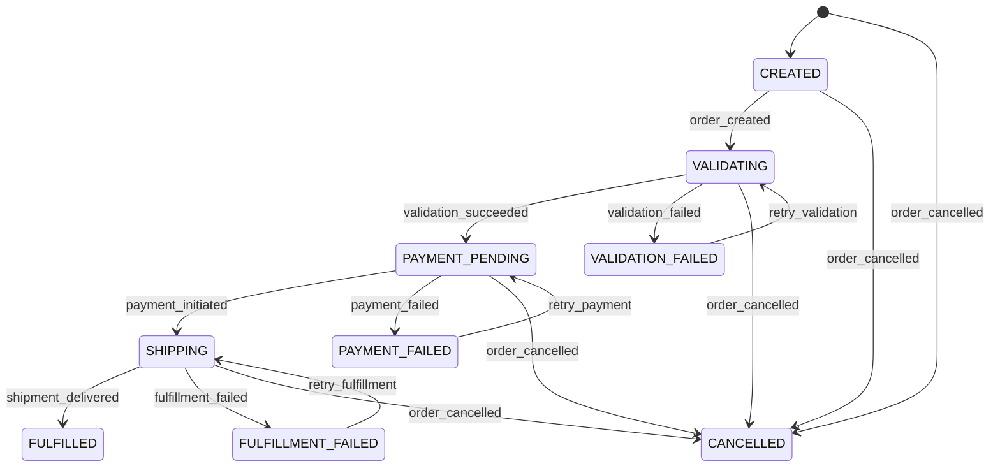

# Order State Machine

The `order-service` uses a state machine to manage the lifecycle of orders, including validation, payment, shipping, error handling, retries, and timeouts. Below is a detailed description of the states, transitions, and mechanisms.

## States
- `CREATED`: Initial state after an order is created.
- `VALIDATING`: Order details and product availability are being verified.
- `VALIDATION_FAILED`: Verification failed due to errors (e.g., insufficient inventory).
- `PAYMENT_PENDING`: Payment processing is initiated.
- `PAYMENT_FAILED`: Payment processing failed (e.g., card declined).
- `SHIPPING`: Order is being processed for shipment (handled by `shipment-service`).
- `FULFILLMENT_FAILED`: Shipment process failed (e.g., logistics issues).
- `FULFILLED`: Order is shipped and delivered.
- `CANCELLED`: Order is canceled by the user or admin.

## State Diagram

## Transitions

| Source State         | Event                  | Target State         | Description                                          | Retry | Timeout            |
|----------------------|------------------------|----------------------|------------------------------------------------------|-------|--------------------|
| `CREATED`            | `order_created`        | `VALIDATING`         | Order details and product availability are verified. | N/A   | Validation timeout |
| `VALIDATING`         | `validation_succeeded` | `PAYMENT_PENDING`    | Successful verification.                             | N/A   | N/A                |
| `VALIDATING`         | `validation_failed`    | `VALIDATION_FAILED`  | Verification errors (e.g., insufficient inventory).  | Yes   | N/A                |
| `VALIDATION_FAILED`  | `retry_validation`     | `VALIDATING`         | Retrying validation after error resolution.          | N/A   | Validation timeout |
| `PAYMENT_PENDING`    | `payment_initiated`    | `SHIPPING`           | Payment processed successfully, shipment begins.     | Yes   | Payment timeout    |
| `PAYMENT_PENDING`    | `payment_failed`       | `PAYMENT_FAILED`     | Payment processing failed (e.g., card declined).     | N/A   | N/A                |
| `PAYMENT_FAILED`     | `retry_payment`        | `PAYMENT_PENDING`    | Retrying payment after error resolution.             | N/A   | Payment timeout    |
| `SHIPPING`           | `shipment_delivered`   | `FULFILLED`          | Order successfully shipped and delivered.            | N/A   | N/A                |
| `SHIPPING`           | `fulfillment_failed`   | `FULFILLMENT_FAILED` | Shipment process failed (e.g., logistics issues).    | Yes   | Shipment timeout   |
| `FULFILLMENT_FAILED` | `retry_fulfillment`    | `SHIPPING`           | Retrying shipment after error resolution.            | N/A   | Shipment timeout   |
| Any                  | `order_cancelled`      | `CANCELLED`          | Order canceled by user or admin.                     | N/A   | N/A                |

## Retry Mechanisms
- Retries are implemented for validation, payment, and shipment processes.
- Configurable parameters: number of retries (e.g., 3) and delay between attempts (e.g., 5 seconds).
- Events like `retry_validation`, `retry_payment`, and `retry_fulfillment` are triggered after timeouts or error resolution.

## Timeouts
- **Validation timeout**: Ensures validation completes within a set period (e.g., 30 seconds).
- **Payment timeout**: Ensures payment processing completes (e.g., 60 seconds).
- **Shipment timeout**: Ensures shipment processing completes (e.g., 120 seconds).
- If a timeout occurs, the state machine transitions to the corresponding error state.

## Error Handling
- Error states (`VALIDATION_FAILED`, `PAYMENT_FAILED`, `FULFILLMENT_FAILED`) capture failures.
- Actions include logging errors, sending notifications via `notification-service`, and triggering retries or cancellations.
- The `order-service` and `shipment-service` publish error events to Kafka for monitoring.

## Integration with Shipment Service
- The `SHIPPING` and `FULFILLMENT_FAILED` states are handled by the `shipment-service`, which integrates with external logistics APIs (e.g., FedEx, DHL).
- The `shipment-service` consumes `payment_initiated` events and publishes `shipment_delivered` or `fulfillment_failed` events to Kafka.